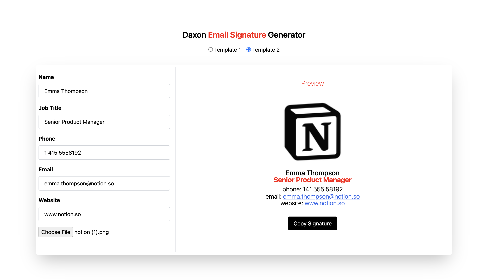

# Email Signature Generator

This is a modern web application built with **Vue 3**, **Vite**, and **Tailwind CSS** that allows users to create clean, customizable email signatures using a simple form and live preview.

---

## 🚀 Features

- 🖊️ **Dynamic Signature Form** – Enter your name, job title, phone, email, and website
- 🎨 **Template Selection** – Choose between two responsive layout templates
- 📷 **Logo Upload** – Upload a company logo directly into your signature
- 🔍 **Live Preview** – Instantly see how your signature will look
- 📋 **Copy to Clipboard** – Easily copy the generated signature as HTML
- 🔐 **Form Validation** – Robust rules ensure input is clean and professional

---
## 🌐 Live Demo

<a href="https://email-signature-generator-steel.vercel.app/" target="_blank" rel="noopener noreferrer">
    👉 View Live Application
</a>

---

## 🛠️ Built With

- **Vue 3** – Composition API & reactive components
- **Vite** – Fast dev server and modern bundler
- **Tailwind CSS** – Utility-first styling

---

## 📸 Screenshots


---

## 📦 Getting Started

### Installation

```bash
git clone https://github.com/rada-ii/Email-signature-generator.git
cd Email-signature-generator
yarn install
```

### Start Dev Server

```bash
yarn dev
```

App will be available at:
```
http://localhost:3000
```

---


## 🤝 Contributing

Contributions are welcome! Open an issue or submit a pull request to suggest improvements.

---

## 📄 License

This project is licensed under the **MIT License**.

---

## 👩‍💻 Author

Developed by [Rada Ivankovic](https://github.com/rada-ii) ✨ 

> "Crafted with care, validated with Vue, styled with Tailwind."
